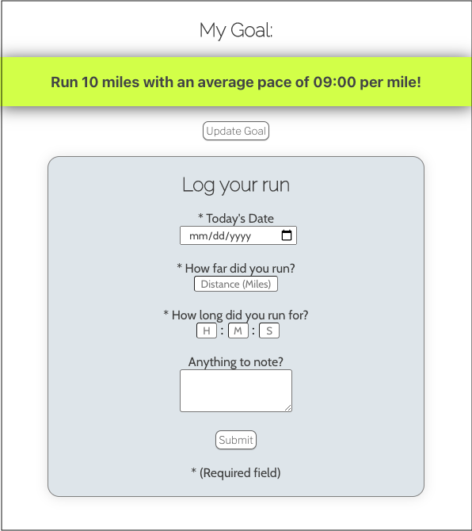
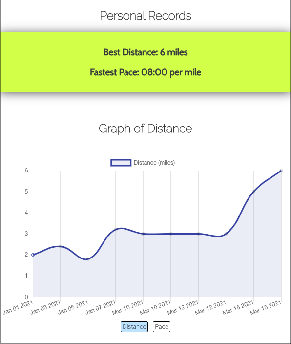

# Run With It

Link to live app: https://run-with-it-app.vercel.app/

## Summary of App

Run With It is a run-tracking app that allows users to log their runs and see their progress in graph-form.

After creating an account and logging in, the user will first be taken to the home page where they can set their goal distance and pace. They will have the option to go back and adjust this goal whenever they want.

Underneath the user's goal is the run log form, where the user inputs the date, distance, time, and any notes for each run they log.

If the user logs a run that meets their goal, they will be presented with a congratulatory message.

Screenshot of the home page:

After the user logs their run, the run data will be displayed in two different graphs in the progress page. The user can toggle between graphs that show the distance and the pace of each run. The user can also hover over each data point in the graphs to see a tooltip with that run's data.

The progress page will also display the user's personal best distance and fastest pace at the top of the page.

Screenshot of the progress page:

In addition to the progress page, the data for each run that the user logs can be seen in the data page. Each run's data is displayed in a separate row containing the run's date, distance, time, pace, and notes. 

## Technology Used

### Frontend

- HTML
- CSS
- Javascript
- React
- Hosted on Vercel

### Backend

- Node.js
- PostgreSql
- Hosted on Heroku

